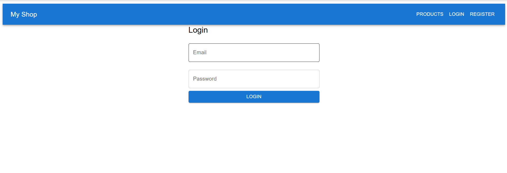
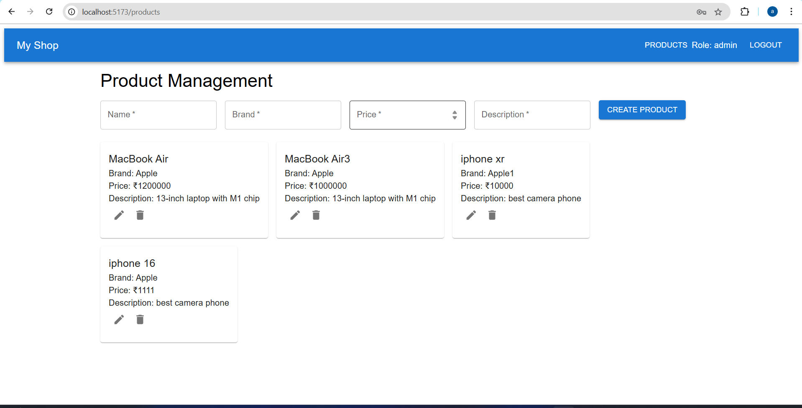
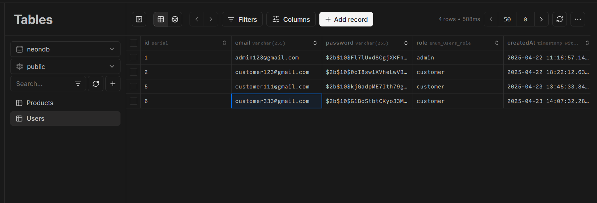
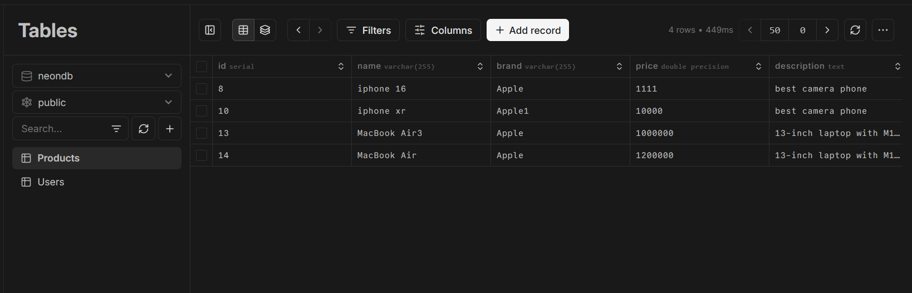

# 🛠️ Full Stack Developer Tech Task

A comprehensive full-stack application demonstrating user authentication and product management functionalities. The application distinguishes between 'Admin' and 'Customer' roles, offering role-based access controls.

## 🚀 Features

- **User Authentication**: Secure login and registration for Admin and Customer roles.
- **Role-Based Access Control**:
  - _Admin_: Full CRUD operations on products.
  - _Customer_: View-only access to products.
- **Product Management**: Create, read, update, and delete products with validations.
- **Responsive UI**: Built with Material-UI for a seamless user experience.

## 🖼️ Screenshots


_Register Screen._


_Login Screen._


_Admin view with product management capabilities._


_Database User Table._


_Database User Table._

## 🧰 Tech Stack

- **Frontend**: React.js, Material-UI
- **Backend**: Node.js, Express.js
- **Database**: MongoDB
- **Authentication**: JSON Web Tokens (JWT)

## 📂 Project Structure

## 🛠️ Setup Instructions

### Prerequisites

- Node.js and npm installed
- MongoDB instance running

### Installation

1. **Clone the repository**:

   ```bash
   git clone https://github.com/Aftab1999/FullStack-Developer-Tech-Task.git

   cd Backend
   npm install

   DATABASE_URL=your_DB_connection_string
   JWT_SECRET=your_jwt_secret

   npm run dev

   cd ..

   npm install
   npm run dev

   ```
